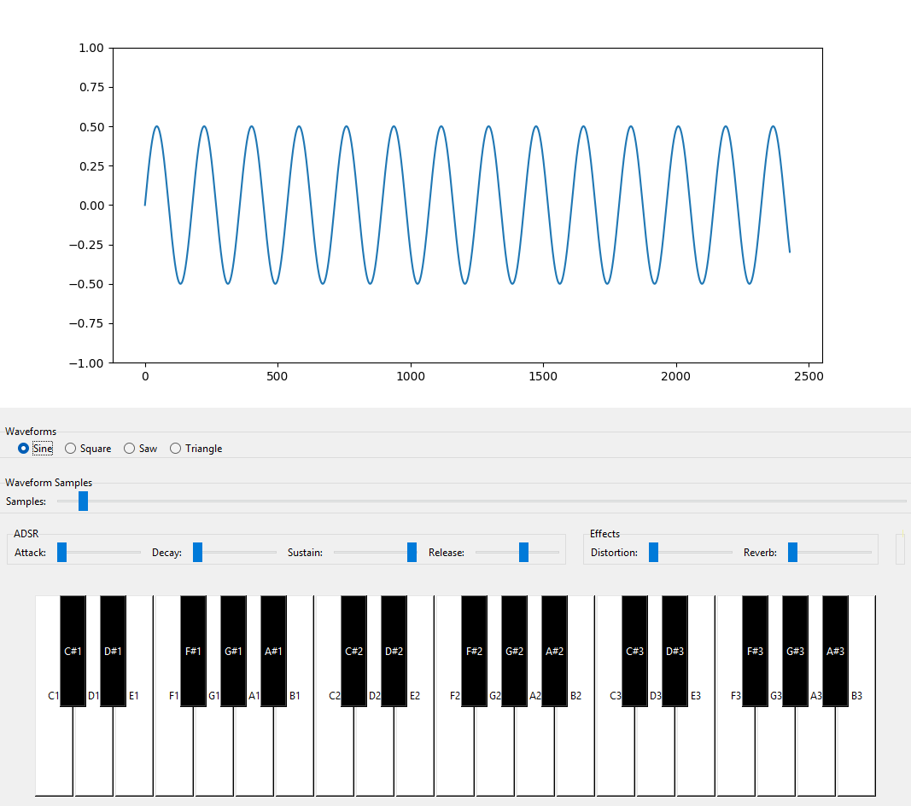

# Mini Synth



### A basic sound synthesizer and waveform visualiser. 
Includes ADSR (Attack, Decay, Sustain, Release) envelope manipulation, waveform shape selection (sine, sawtooth etc.) and a three-octave keyboard.


# How to run:

### Install necessary libraries:
```bash 
pip install numpy pyaudio matplotlib scipy
```

### Navigate to src and run main.py
```bash 
cd src
python main.py
```